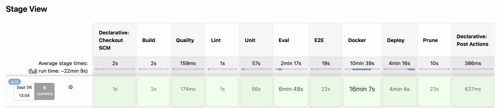

# Bill Auditor

Audits an Indian health insurance claim bill against the policy that governs it,
line by line, and names the clause behind every deduction. Where no clause
clearly applies, the line is flagged for a human rather than guessed at.


<!-- SCREENSHOT: the /audit page at 1440. Replace docs/audit-1440.png. -->

## Results

Every figure below is a row in [`eval/results.md`](eval/results.md). Nothing here
is rounded, averaged across runs, or carried over from an earlier version.

### The headline: 44 bills, 328 lines

Recorded as `v11-zero-limit-guardrail`, 2026-09-04, backend ollama (`qwen3:8b`),
retrieval on cpu.

| metric | value |
|---|---|
| **Line accuracy** (allowed within Rs 1) | **55.2%** |
| Citation accuracy | 43.2% |
| Payout error | 56.4% |
| Abstention recall (flagged when it should) | 90.0% |
| False answers (answered, should have flagged) | 3 |
| Dodges (flagged, key has an answer) | 117 |
| **Fabricated clause citations** | **0** |

**0 fabricated citations across every recorded version, v0 through v11** — all
17 rows in `results.md`. A citation naming a clause that does not exist in the
index is the worst failure this system can produce, because it is the one a
reader cannot catch by reading. It is tracked as a metric that must stay at
zero, and it has.

### A different denominator: the 10-bill ladder

> **These are 10 bills / 82 lines, not 44. They are not the headline and must
> never be quoted as it.** The subset is held constant so versions compare
> against each other; the ten are easier than the forty-four. **68.3% on ten
> bills is not 68.3% on the set.**

| version | what changed | line accuracy (10 bills) |
|---|---|---|
| v0 | naive retrieve-and-judge baseline | 24.4% |
| v4 | deterministic room-rent lookup | 59.8% |
| v5 | waiting periods decided before judging | 68.3% |

The ladder measures whether each mechanism helped. The 44-bill number measures
how the system actually does. They are different questions and different
denominators.

### The CI gate

`ci-baseline-v7-quick`, 2026-09-03: **56.1%** over 10 bills / 82 lines. Jenkins
runs `--quick` against that row at `--threshold 0.52`, just under three lines
below the baseline.

The gate deliberately sits on the subset, not the full set, so it is fast enough
to run on every push. It is compared only with other subset rows.

**474 tests** (PyUnit, `unittest discover -s tests`, ~100s).

---

## What the evaluation does not measure

The accuracy number above is a real measurement of a real thing, but it is not
what a casual reader assumes it is. Two limits matter enough to state before the
number is quoted anywhere. Both are recorded in full in
[`KNOWN_LIMITATIONS.md`](KNOWN_LIMITATIONS.md), sections 6 and 7.

**The answer key was not written by a human reading the policies.** Its
substance came from a model reading the same PDFs the judge reads. Worse,
`eval/derive_key.py` and `core/` share a line taxonomy — the same `AME_RE` and
`ROOM_RE` patterns decide what counts as an associated medical expense and what
counts as room rent on both sides of the comparison. **So a misreading shared by
both scores as correct.** The number measures agreement between two
implementations that were built from the same reading of the same documents. It
is not a measurement of correctness against the documents themselves. Closing
this needs a human with the PDFs; 72 rows across 5 questions are already queued
for exactly that in `eval/answer_key_todo.md`.

**The citation is verified. The figure attached to it is not.** Every verdict's
`clause_id` is checked against `data/clauses.json`, and a fabricated one is
rejected and retried — that is where the 0 comes from. But nothing checks that
the clause *says* what the verdict claims about it, except in one case: a limit
of zero. Guardrail 3 (`core/exclusion.states_an_exclusion`) asks whether a
clause cited for a Rs 0 limit actually states an exclusion, because a confident
"not payable" beside a real clause reference is the most damaging shape of wrong
answer. **Every other rupee figure is unverified.** Checking them all is a much
larger problem with real false-rejection risk, and it is not built.

---

## Two things that were broken in ways nothing could see

### 1. A space glyph painted on top of a letter

Star Health's policy PDF emits a space at the same cursor position as the first
character after a list marker, so the two overlap. The page renders correctly —
the space paints nothing. But `pdfplumber` sorts characters by position, and the
space sorts *between* the character and the rest of its word.

Measured on page 28 of `star_health.pdf`:

```
previous glyph  '\t'   x0=552.755  x1=555.692  top=299.974
phantom space   ' '    x0=552.755  x1=555.692  top=299.974
next glyph      'p'
extracted as:   '\t pre-existing'
```

The space box is 2.937pt wide and sits **entirely inside** the 2.937pt box of
the glyph before it — identical coordinates, not merely overlapping.

The clause index carried `"E xpenses related to the treatment"`, `"T eaching
hospital"`, `"A utomatic Restoration of Sum Insured"`. BM25 cannot match a term
broken in half, so those clauses were unreachable by the lexical channel and
nobody noticed, because the text still looked like text.

The fix (`core/splitter.without_phantom_spaces`) is applied to the page before
extraction, not to the finished string, and the rule is geometric: **a space
whose box lies entirely inside the box of the character before it, on the same
line, where neither neighbour is itself a space.** A real space advances the
cursor past the previous glyph, so its box begins at that glyph's right edge; to
be caught by this rule the previous glyph would have to cover it completely,
which would mean the next word was painted over the last one.

Across all four documents: **50,297 spaces examined, 79 caught, every one in
star_health.** The index went from 402 clauses to 402 — none added, none
removed. **26 clause bodies and 6 titles repaired, total character delta −50,
and every diff is a deletion of whitespace and nothing else.** One `rule_type`
changed as a consequence: `III.23` moved from `other` to `non_payable` once its
title read "Injury/disease caused by…" instead of "I njury/disease".

### 2. A CI stage that was green and red for the same wrong reason

The end-to-end stage started both servers in the background, waited for
*something* to answer port 5173, and then killed a pid that was not the one
holding the port — `npx` forks vite as a child, so every build donated an orphan
to the next.

```
develop #17:  16:27:20  + curl -sf http://localhost:5173
              16:27:20  + break
```

One second into the stage, before `npm ci` had finished. Selenium then drove a
frontend built by some earlier run and timed out on an element that bundle did
not have.

`main #11` shows the same defect **passing**. Its own preview server died with
"Port 5173 is already in use", the failure was swallowed by the background
subshell, and four tests went green against a build nobody made.

**Neither result was real, and that includes every green one before it.** A
stale server answers instantly, which is precisely why waiting longer never
helped.

The stage now refuses to run the test unless three things hold:

1. **the process holding the port is in this run's process group** — each server
   is started as a process-group leader so ownership is provable, not inferred
   from a port number;
2. **the bytes served carry this run's build stamp** — a random stamp written
   into `dist/` and read back over HTTP;
3. **the bundle was built against the API base this run is serving** — recorded
   at build time, because a skipped build writes a fresh stamp over a `dist/`
   this run never made.

No one of the three is sufficient. The stamp cannot catch a survivor, because
Jenkins keeps its workspace and an orphan serves the same `dist/` this run just
rebuilt. The group check cannot catch a server that is ours but serving a
half-written `dist/`. And neither catches a skipped build pointing at the wrong
backend.


<!-- SCREENSHOT: the green main stage view. Replace docs/jenkins-main-green.png. -->


<!-- SCREENSHOT: a red Eval stage. Replace docs/jenkins-eval-red.png. -->

---

## How it works

Setup runs once, offline: policy PDFs → `pdfplumber` text → a **custom regex
splitter on clause numbers** (never a character-based text splitter — chunking
by character loses the clause number, and citation becomes impossible) →
`data/clauses.json` → bge-base embeddings in ChromaDB plus an in-memory BM25
index over the same clauses.

Per bill line, a LangGraph loop: non-payable fast path (zero model calls) →
classify the rule type → build a query → hybrid retrieve (Chroma 20 + BM25 20,
fused 0.6/0.4) → cross-encoder rerank to the top 3 → judge → guardrails →
**Python computes the amount**. On low confidence the query is rewritten from a
different angle and retried, capped at 3 attempts, then the line abstains.

Two decisions shape everything else:

**The model never does arithmetic.** `JudgeOutput` has no `allowed` field by
design. The model returns a limit and a `clause_id`; Python multiplies and
subtracts. An 8B model is unreliable at arithmetic and a wrong total is
invisible to the person reading it.

**After all lines are judged, one breached room-rent cap rewrites the others.**
Judging lines independently can never find this — nothing in a surgeon's-fee
line mentions room rent — yet the policy's proportionate-deduction clause makes
one breached cap reduce every associated expense on the bill.

## Running it

```bash
uv sync
uv run python -m unittest discover -s tests     # 474 tests
uv run uvicorn api.main:app --reload            # API on :8000, docs at /docs
uv run python eval/evaluate.py --agent          # full 44-bill eval
uv run python eval/evaluate.py --quick --threshold 0.52   # the CI gate
```

Ollama must be running with `qwen3:8b` pulled for anything that reaches the
model. Every model call is cached to disk by prompt hash, because the eval is
re-run many times.

## The published front end

The UI is deployed to GitHub Pages at
<https://pavansai2608.github.io/bill-auditor/> by
[`.github/workflows/pages.yml`](.github/workflows/pages.yml) on every push to
`main`. It is a separate path from Jenkins and does not touch it.

**It cannot run an audit, and it says so rather than pretending.** Pages serves
files; the audit searches a 402-clause index and puts every line to an 8B model
running locally. The form is therefore disabled, with the quickstart above in
its place — and the one thing a static file can honestly show is offered
instead: a report the system really produced, exported from an eval checkpoint
by `eval/export_example_report.py`, with its real figures and its real clause
citations. `tests/test_example_report.py` holds that file to the clause index,
because a fabricated citation in a committed JSON is not covered by the metric
that keeps fabrications at zero everywhere else.

The build is `npm run build:pages`, and everything that makes it different is a
consequence of Pages serving from a **subpath** with no rewrite rule in front:
assets written under `/bill-auditor/`, the router basename read from
`import.meta.env.BASE_URL`, and `index.html` copied to `404.html` so a hard
refresh on a deep link still boots the app. All three fail only in production —
they work perfectly against a dev server at the domain root — so
`tests/e2e/pages_static_check.py` serves `dist/` the way Pages does and checks
them in a browser.

## Layout

| path | what is in it |
|---|---|
| `core/` | all logic — splitter, retrieval, agent loop, second pass, guardrails, money |
| `api/` | FastAPI. Audits take 30–60s, so `POST /audit` returns a job id and the client polls |
| `frontend/` | React + TypeScript + Vite |
| `services/` | the same `core/` split into four containers |
| `eval/` | 44 bills, the answer key, and `results.md` |
| `ENGINEERING.md` | Why the splitter, retrieval, guardrails and pipeline work as they do |
| `ci/` | the image pruner the Jenkins Prune stage calls |
| `k8s/`, `Jenkinsfile` | deployment and the pipeline |
| `.github/workflows/` | the static front end on GitHub Pages, separate from Jenkins |
