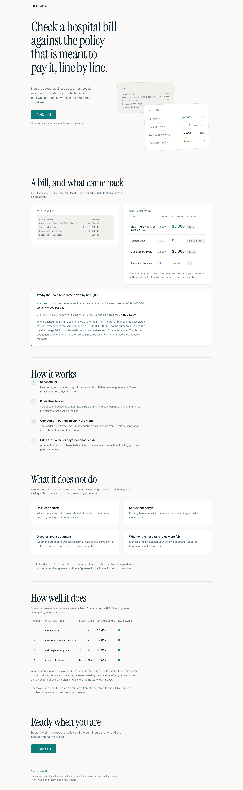
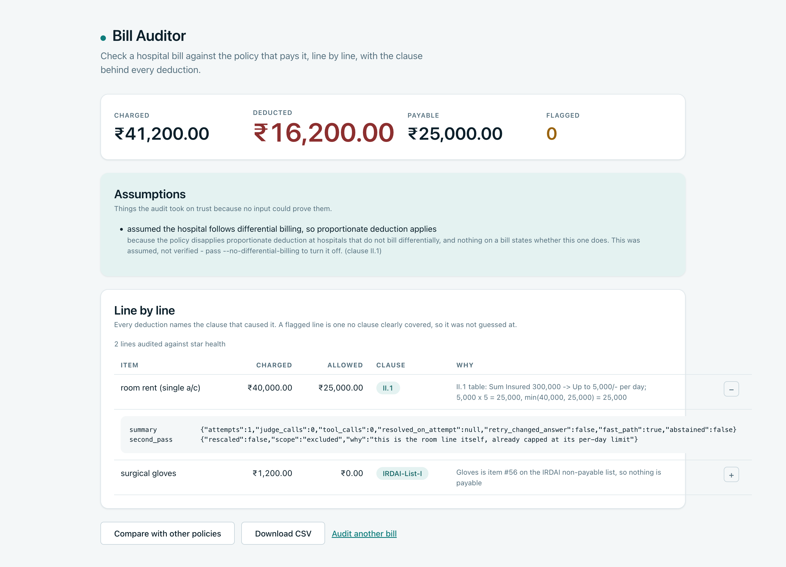
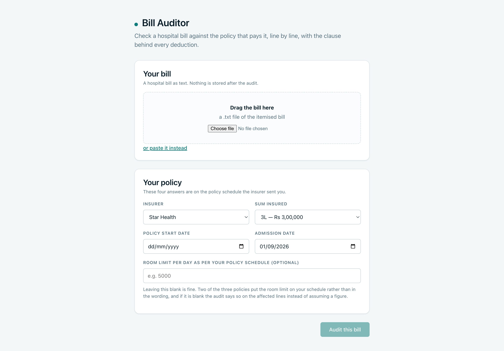

# Bill Auditor

Audits an Indian health insurance claim bill against the policy that governs it,
line by line, and names the clause behind every deduction.



## Results

Scored against hand-written bills whose answers were derived from the policy
PDFs directly, never from this system. Line accuracy means the rupee figure
matches the key within Rs 1.

The version rows are the ten-bill quick run used to compare one version against
the next. The last row is the same v5 system over the whole 44-bill set, and it
is the number to plan around.

| Version | What changed | Bills | Line accuracy | Citation accuracy | Fabricated citations |
|---|---|---|---|---|---|
| v0 | Naive: one search, one judge call, no retry | 10 | 24.4% | 22.2% | **0** |
| v2 | LangGraph agent loop, retried on low confidence | 10 | 51.2% | 33.3% | **0** |
| v3 | Proportionate-deduction second pass | 10 | 54.9% | 44.4% | **0** |
| v4 | Room limit read from the table, not the model | 10 | 59.8% | 48.1% | **0** |
| v5 | Waiting periods decided from dates, not the model | 10 | **68.3%** | **56.8%** | **0** |
| v5 | The same system, every bill in the set | 44 | 59.5% | 51.9% | **0** |

A fabricated citation — a clause id that does not exist in the policy — is the
worst thing this system could produce, because it is confident and
unverifiable. It has been 0 at every version, and the way it is counted has its
own test.

Full tables, including two rows that were withdrawn and re-run with the reason
recorded, are in [`eval/results.md`](eval/results.md).

## The problem

An insurer pays part of a hospital bill and sends a letter saying "deducted as
per policy terms". The patient has no way to check that. The rules are real,
but they are spread across a 50-page PDF written for lawyers.

Here is a real bill this system audited, on a Star Health policy with a
Rs 3,00,000 sum insured:

| Item | Charged | Payable | Because |
|---|---|---|---|
| Room rent (single A/C), 8,000 x 5 days | 40,000 | 25,000 | II.1 caps the room at 5,000 a day at this sum insured |
| ICU charges | 60,000 | 10,000 | judged against the same clause |
| Surgeon fee | 80,000 | 9,375 | reduced in proportion, because the room breached its cap |
| Anaesthetist charges | 15,000 | 9,375 | same proportionate deduction |
| Medicines and drugs | 38,000 | 38,000 | II.16 |
| Surgical gloves | 1,200 | 0 | item 56 on the IRDAI non-payable list |
| Disposable syringes | 1,500 | **flagged** | no clause clearly covered it, so it was not guessed at |
| Ambulance charges | 2,500 | 750 | II.8 caps road ambulance at 750 |

**Rs 2,40,000 charged, Rs 94,000 payable, one line flagged for a human.**

The surgeon's fee is the interesting one. Nothing in that line mentions the
room. It was reduced because the *room* breached its cap, and the policy shrinks
the associated medical expenses in the same proportion. No line-by-line check
can ever find that.

Two things it gets wrong, in its own words: a cataract bill with no sub-limit
comes back flagged rather than paid in full, and a Star Health bill inside the
24-month waiting period is not excluded because that policy's list of conditions
did not survive PDF extraction. Both are in
[`KNOWN_LIMITATIONS.md`](KNOWN_LIMITATIONS.md).

## How it works





Setup runs once, offline: the policy PDFs are split on their clause numbers into
402 numbered clauses, embedded into ChromaDB, and indexed for BM25. Tables are
read structurally rather than as flowing text, because `extract_text()` reads a
room-rent table straight across and puts the wrong limit next to the wrong sum
insured.

Then, per bill line:

1. **Non-payable fast path.** Gloves, syringes and the rest of the IRDAI list
   are settled with no search and no model call. About a third of real bill
   lines are consumables.
2. **Room rent is a lookup.** Policy plus sum insured names the table row. The
   model is not asked, because it once read 800 a day off a table that grants a
   room category.
3. **Waiting periods are a date subtraction.** Two dates and the number the
   clause states.
4. **Everything else goes to the loop:** classify the rule type, build a query,
   hybrid retrieve (Chroma and BM25 fused 0.6/0.4), rerank to the top 3, then
   ask the model one narrow question — which clause applies and what limit does
   it state.
5. **Python does the arithmetic.** Always.
6. **The second pass.** Once every line has a verdict, a breached room-rent cap
   rescales the associated medical expenses. This is the part no per-line audit
   can do.

## How it decides when to stop

- **Three attempts, eight tool calls.** Then it abstains.
- **A confident answer is never re-asked.** Re-asking is where latency goes for
  no accuracy.
- **Two identical retrievals in a row stop the loop.** A third would cost a
  model call and tell us nothing.
- **A citation that is not in the index is rejected outright**, and the line
  abstains rather than retrying — the model was confident, so asking again gets
  the same answer.
- **Below the rerank threshold the model is not called at all.** Reasoning over
  clauses that do not apply is worse than admitting the search missed.
- **When it abstains it says why**, and the line goes to a human.

The LLM never computes an amount. `JudgeOutput` deliberately has no `allowed`
field: the model reports a limit and a clause id, and Python multiplies. An 8B
model asked to multiply 5,000 by 5 will sometimes answer 20,000 and sound
certain, and a wrong total is invisible in a way a wrong citation is not.

## Known assumptions

Both Star Health and HDFC Ergo disapply proportionate deduction at hospitals
that "do not follow differential billing". Nothing on a hospital bill says
whether that hospital does, and no input to this system could carry it.

So the assumption is made — the deduction applies — and it is **printed with
every report**, stored in the trace with the clause that creates the problem,
and shown on screen in a panel that is never behind a toggle. `--no-differential-billing`
turns it off.

The other one is the room limit. Two of the three policies state no figure at
all: HDFC says "At Actuals unless otherwise specified in the Policy Schedule",
and Niva Bupa caps by room category "as specified in your Policy Schedule". So
there is an optional fourth input for it, and **leaving it blank is a valid
answer**: room-dependent lines come back flagged with the reason "room limit is
set by the policy schedule, which was not provided". Not a default. Not a guess.

## Evaluation

44 bills, 330 lines, across the three policies, covering clean bills, room-rent
breaches, non-payable items, sub-limits and waiting periods.

**The answer key was derived by reading the policy PDFs, not by running the
pipeline.** `eval/derive_key.py` opens the PDFs with pdfplumber and imports no
retriever, judge or audit code, so a bug in the system cannot write itself into
the key and then be scored as a success. Every answered line quotes the sentence
it came from and shows the arithmetic:

```
"II.1 p10 table: Sum Insured 300,000 -> Up to 5,000/- per day;
 5,000 x 5 = 25,000, min(40,000, 25,000) = 25,000"
```

Ten of the 44 were then checked by hand against the source PDFs; the list is in
`eval/answer_key_provenance.md`.

Every metric is deterministic — a number matches or it does not, a clause id
matches or it does not. Nothing is scored by a model. An LLM judging its own
output would only tell us the system agrees with itself.

Category accuracy at v5:

| Category | Lines | Accuracy |
|---|---|---|
| non_payable | 29 | 79.3% |
| clean | 15 | 73.3% |
| waiting_period | 7 | 100% |
| room_rent_over | 25 | 60.0% |
| sub_limit | 6 | 0.0% |

## Architecture

Six containers. Only the gateway and the frontend are published; the three inner
services are reachable on the compose network and nowhere else.

```
browser ──> frontend (nginx)
                │
                v
            gateway ──────> audit-service ──> retrieval-service ──> Chroma + BM25
                │                 │
                │                 └────────> ollama (qwen3:8b)
                └──────────> ingestion-service ──> Chroma
```

They are split because they scale differently, which is the only honest reason
to split anything:

- **ingestion** is heavy but rare. Splitting and embedding three PDFs takes
  minutes and a lot of memory, and happens when a policy is added, not when a
  bill is audited.
- **retrieval** is light and frequent. Every line calls it; it answers in
  milliseconds and holds the indexes in memory. It is the one worth running two
  of.
- **audit** is slow and CPU-bound. One request occupies a worker for most of a
  minute. It gets the largest limits in `k8s/`.

`core/` stays a shared library that every service imports. The audit rules are
the product, and two copies of `money.py` would eventually disagree — as a wrong
rupee figure rather than an error.

## CI/CD

Jenkins multibranch. `feature/*` runs Build and Quality; `develop` adds Eval and
E2E; `main` adds Docker and Deploy.

**The Eval stage is the distinctive part.** It runs the auditor against the
answer key and fails the build when line accuracy drops below 0.65:

```
FAIL: line accuracy 0.610 is below the threshold 0.650
```

Unit tests can pass while the audit quietly gets worse — a retrieval change, a
prompt change, a splitter change. This stage is what makes that visible, and
`git bisect run` with the same command finds the commit that did it.
Step-by-step setup, including what to do when that stage goes red, is in
[`JENKINS_SETUP.md`](JENKINS_SETUP.md).

## What I learned

- **A PDF table flattened into text corrupts every rupee figure downstream, and
  nothing errors.** Star Health's room-rent table read straight across put
  `5,00,000` next to the limit belonging to the 3L and 4L rows. The output still
  looked like text, so nothing failed — it broke three times before the golden
  files caught it.
- **Both big accuracy jumps came from taking the model out of the decision, not
  from prompting it harder.** The room limit (v4) and the waiting periods (v5)
  are a table lookup and a date subtraction. Together they were worth 13 points.
- **A scoring bug made 18 correct citations look like fabrications.** The scorer
  built its list of legitimate citations from `clauses.json` alone, so the IRDAI
  non-payable list — a real, checkable source — was counted as invention. The
  metric now has its own test, because a metric that can break silently is worse
  than no metric.
- **One wrong number can cost four wrong lines.** When the judge misread a room
  limit, the second pass faithfully propagated that wrong premise to every
  associated expense. Errors in a pipeline do not stay where they start.
- **A local model made every line 5x slower, and only a third of that was the
  model.** One bill line, same clause, one judge attempt, measured on an idle
  machine with `eval/where_time_goes.py`:

  | | Groq (hosted) | Ollama (local) |
  |---|---:|---:|
  | **Total per line** | **6.1s** | **29.5s** |
  | Retrieval, 2 searches | 3.7s | 18.3s |
  | Model call | 1.7s | 8.1s |
  | Rate limiter asleep | 0.0s | 0.0s |

  The model call is 4.8x slower locally, which is expected. The surprise is the
  retrieval row: it is *the same work* in both runs — the same two searches, the
  same cross-encoder, no model involved — and it takes five times longer when
  Ollama is the backend. Ollama saturates the CPU that the reranker needs. Two
  components that never call each other, coupled through the machine they share.

  What that implies is the part worth keeping: on a single box, "use a local
  model to stay free" is not a self-contained decision. It taxes every other
  CPU-bound stage of the pipeline, and the bill arrives somewhere you were not
  looking. That is the argument for the hosted backend being the API's default —
  measured, not assumed.

  Two guesses died on the way to this table. The rate limiter never slept, so
  "the token cap is throttling us" was wrong. And "the LLM was never the
  bottleneck" was wrong too — locally it is 27% of the line directly and a good
  share of the retrieval row indirectly.

- **The first request after a deploy was paying for a model load.** Loading
  bge-base and the cross-encoder takes 44-74s on the host and **606s in a fresh
  container**, which has no HuggingFace cache and downloads them first. Whoever
  arrived first waited for it, and in Kubernetes it was worse: the readiness
  probe pointed at `/health`, which passes the moment uvicorn binds, so traffic
  was routed to a pod that was still warming. The services now warm up in a
  background thread at startup and expose `/ready`, which returns 503 until the
  models are loaded; readiness gates on that, liveness stays on `/health` so a
  slow warm-up cannot restart the pod it is waiting for.

  **The 606s was a download, not a load** — and that is a dependency, not a slow
  start: the pod could not serve traffic without HuggingFace being reachable, on
  every restart, and on a box with no internet it would never start at all. The
  weights are now fetched in the builder stage and `HF_HUB_OFFLINE=1` is set in
  the final image, so a missing file fails the build instead of a pod. `docker
  compose up -d` to `/ready` returning 200:

  | | cold start | of which, model load | readiness window |
  |---|---|---|---|
  | downloading at boot | 606s | — | 15 min |
  | baked into the image | **13.8s** | 10.5s | 3 min |

  The cost is 1.5 GB in retrieval-service (bge-base plus the reranker) and
  419 MB in ingestion-service, which embeds but never reranks. A bigger image
  against a pod that starts in fourteen seconds and works with the network
  unplugged is the right trade for a single box.

- **A fallback that never came back.** A Groq call that fails is meant to fall
  back to Ollama for that call. It was implemented as `use_backend(OLLAMA)` — a
  module-level mutation — so one transient failure moved the whole process to
  the local model permanently: every later line in that audit, and every later
  audit in that container, at 29.5s instead of 6.1s. Nothing surfaced it,
  because `/health` reported `settings.ollama_model` unconditionally, so it
  described the configured backend rather than the live one either way. A
  seven-minute audit looked like a slow model.

  Fixed as a genuine per-call fallback with a cooldown that expires, so the
  process recovers without a restart, plus a `/stats` endpoint reporting what is
  actually running — backend in force, whether it fell back, workers, and where
  the seconds went. Two existing tests had to be rewritten: they asserted
  `active_backend() == OLLAMA` after a failure, which was pinning the defect in
  place as if it were the contract.

- **Caching the search was worth more than making it cheaper.** Retrieval is
  ~92% of an audit, so the obvious move was to halve the rerank candidates,
  20+20 to 10+10. Line accuracy went 68.3% to 67.1% — one line in 82, with
  citation accuracy moving the other way, so quite possibly noise. Reverted
  anyway: deciding a regression is noise *because* you wanted the change is how
  a threshold gets loosened.

  What worked instead was caching the retrieve-sub-chunk-rerank stack on
  `(query, policy)`. B01 through the gateway, with the LLM cache already warm
  so **both** runs made zero model calls:

  | retrieval cache | model calls | wall clock |
  |---|---|---|
  | cold | 0 | 207.0s |
  | warm | 0 | **0.3s** |

  Both runs called no model at all, so those 207 seconds were retrieval and
  nothing else. The honest caveat: re-running an identical bill is the best
  possible case. Across different bills the overlap is partial — gloves,
  syringes and room rent recur, but the six retried lines rewrite their queries
  into keys nothing has seen. It is a demo-replay ceiling, not a typical audit,
  and the first run costs exactly what it always did.

- **Parallelism turned a latent GPU race into a crash, on the one machine the
  containers do not resemble.** Judging lines concurrently killed the eval on
  bill one, every run — SIGSEGV, then SIGABRT once the model-load race was
  fixed and the failure moved from loading to inference:

  ```
  failed assertion _status < MTLCommandBufferStatusCommitted
  at -[IOGPUMetalCommandBuffer setCurrentCommandEncoder:]
  ```

  On a Mac the embedder and reranker sit on the MPS device and share one Metal
  command queue; two threads touching it aborts the process. The containers
  ship CPU-only torch and never see it, which is exactly why it had to be fixed
  rather than left for whoever next runs the eval on a laptop. Serialising the
  forward passes costs almost nothing — and that is measured, not hoped: two
  workers only beat one by 1.27x because a single search already saturates
  every core, so those passes were never really overlapping.

- **The obvious optimisation was applied to the part that was not the problem.**
  The audit judged bill lines in a `for` loop for the whole project. Lines are
  independent in the first pass, so bounded concurrency needed no change to any
  audit rule — a `ThreadPoolExecutor` and `BA_AUDIT_WORKERS`. I expected roughly
  4x. B01 through the gateway on Groq, cache off, idle machine:

  | workers | wall clock | per line | speed-up | in the model | limiter asleep |
  |---|---|---|---|---|---|
  | 1 | 222.6s | 22.3s | 1.00x | 14.1s | 0.0s |
  | 2 | **175.1s** | 17.5s | **1.27x** | 16.7s | 0.0s |
  | 4 | 170.6s | 17.1s | 1.30x | 14.6s | 37.3s |

  **1.27x, not 4x.** The model is 6-8% of a line at every width; retrieval is
  the rest, and one search already pegs all ten cores, so extra workers queue
  for a resource that was never idle. The fourth worker buys 2.6% — noise — and
  puts the token bucket to sleep for 37 seconds. The default is 2. Making an
  audit materially faster means a cheaper reranker, not more of it at once,
  and 6 of the 10 lines retried, so each of those paid for retrieval two or
  three times.

  The pool also found a bug that sequential execution could not reach:
  `lru_cache` is not atomic, so all four workers missed the same cold cache and
  each opened its own ChromaDB client on one directory — `'RustBindingsAPI'
  object has no attribute 'bindings'`, then `Could not connect to tenant
  default_tenant`, as a 500. Concurrency did not cause it; it made a latent
  race reachable on the first request.

- **35 GB of images became 4.6 GB by asking what each service actually
  imports.** Two questions, no cleverness:

  | Image | Before | Split by imports | Plus CPU-only torch |
  |---|---:|---:|---:|
  | gateway | 8.82 GB | 350 MB | **350 MB** |
  | audit-service | 8.82 GB | 354 MB | **354 MB** |
  | retrieval-service | 8.82 GB | 8.64 GB | **1.93 GB** |
  | ingestion-service | 8.82 GB | 8.72 GB | **2.01 GB** |
  | **Total** | **35.3 GB** | 18.1 GB | **4.64 GB — 87% smaller** |

  Every service installed the whole `requirements.txt`, so the gateway — which
  forwards HTTP and reads a JSON file — shipped `sentence-transformers`, and
  through it `torch`. Splitting the dependencies into extras and giving each
  service its own generated file took the two that never embed anything down by
  96%.

  That left the two that do embed at 8.6 GB, and `du` inside the image said why:
  **nvidia 2.9 GB and triton 650 MB**, the CUDA build of torch, in a container
  with no GPU to use it — Docker Desktop on macOS has no passthrough and the k8s
  manifests request no device. Pinning torch to the CPU wheel index removed
  three and a half gigabytes per image.

  Two details worth keeping. `[tool.uv.sources]` only applies to *direct*
  dependencies, so torch had to be named in `pyproject.toml` even though it
  arrives through `sentence-transformers`. And the split only works because the
  heavy imports are lazy: `core.embeddings` imported `sentence_transformers` at
  module level, and `services/common.py` imports `core.ingest`, so every
  service pulled torch simply by starting up.

  The reranker turned out to be a dead end worth recording: ingestion never
  reranks, but `HuggingFaceCrossEncoder` lives in `langchain-community`, which
  ingestion needs anyway for the BM25 index it builds. The reranker *model* was
  never in the image — it downloads at runtime. No saving there.

## Where it still fails

- **Sub-limit lines abstain when there is no sub-limit.** The loop can find a
  cap or fail to find one; it has no way to say "nothing limits this line, so
  pay it in full". Five of six lines on a cataract bill come back flagged.
- **Star Health waiting periods are not applied.** Its clause III.2 states the
  24 months and then says "f. List of specific diseases/procedures;" — and the
  list is on the next page and did not survive extraction. The system refuses to
  act on a list it cannot read.
- **Pre-existing disease is never applied.** Nothing on a bill says whether a
  condition pre-dated the policy.
- **The recorded numbers are from 10 of the 44 bills.** A full run takes about
  45 minutes.

All four are written up with diagnoses in [`KNOWN_LIMITATIONS.md`](KNOWN_LIMITATIONS.md).

## What this doesn't do

It does not handle cashless authorisation denials, settlement delays, or
disputes about whether a treatment was medically necessary. It does not judge
whether the hospital's rates were fair — only what the policy says the insurer
owes against the rates charged. It is not legal advice, and a flagged line means
a person still has to look.

## Two LLM backends, for two different jobs

| Backend | Model | Speed | Limits | Default for |
|---|---|---|---|---|
| `ollama` | Qwen3 8B, local | ~11s a line | none, works offline | the eval, the CLI, the tests |
| `groq` | gpt-oss 120B, hosted | ~1s a call | 30 req/min, 6,000 tokens/min, 1,000 req/day | the API and the UI |

The split exists because the two are good at opposite things. Groq is fast per
call and rate limited; Ollama is slow per call, unlimited and offline. A person
waiting on a ten-line bill should not wait two minutes, and a 44-bill
evaluation is roughly 400 calls — it would spend Groq's entire daily allowance
and then crawl under the token cap.

Every default lives in `core/config.py` (`backend_for`), never at a call site.
`BA_LLM_BACKEND` overrides all of them, which is how Docker and Kubernetes
choose with no code change, and `--backend` forces one for a single run:

```bash
uv run python eval/evaluate.py --quick --agent --backend groq
uv run python -m core.audit bill.txt --backend ollama
```

Four things hold across both, and each has a test:

- **The judge contract.** Both go through the same
  `with_structured_output(JudgeOutput)` path, so parsing that works for one and
  not the other is a bug rather than a difference of backend.
- **The disk cache is keyed by backend and model**, so switching does not serve
  a Qwen answer as a Llama one.
- **Masking runs first, and the hosted path refuses text that still contains an
  identifier.** `core.backends.guard_pii` raises before the client is reached.
  That guard is what makes a hosted backend acceptable at all.
- **Fabricated-citation checking is unchanged.** Same rules, both backends.

The token cap binds before the request cap — 6,000 tokens a minute is about six
judge calls, well inside the 30 requests the same minute allows — so the
limiter counts tokens, not requests. A 429 is retried with exponential backoff,
honouring Groq's own `try again in Ns` when it sends one. When the *daily*
quota is gone the audit does not stop: it finishes on Ollama, logs the switch,
and records it in the report's assumptions block, because a report that changed
model half way through has to say so.

The same fallback covers a dead network, which is the likelier failure when you
are demonstrating this in a room with bad wifi. Groq gives you nothing; the
laptop's model is still there. A wrong model name or a rejected key is treated
differently — those fail on the first call rather than being retried, because
they are a configuration mistake and will fail identically every time.

Get a free key at <https://console.groq.com/keys> and put it in `.env` as
`BA_GROQ_API_KEY`. See `.env.example`; `.env` is gitignored.

## Running locally

```bash
uv sync
ollama pull qwen3:8b                     # the judge model, running on your machine
uv run python -m core.ingest             # build the clause index, once

uv run uvicorn api.main:app --reload     # API on :8000, docs at /docs
cd frontend && npm install && npm run dev # UI on :5173
```

On the command line, without the browser:

```bash
uv run python -m core.audit data/sample_bill.txt --policy star_health --sum-insured 300000 \
  --agent --second-pass --admission-date 2026-01-10 --policy-start-date 2023-01-01
```

Tests and the evaluation:

```bash
uv run python -m unittest discover -s tests          # 233 PyUnit tests
uv run pyb run_unit_tests                            # the same, the way Jenkins runs them
uv run python eval/evaluate.py --quick --agent --second-pass
```

## Running with Docker

```bash
docker compose build
docker compose up -d
docker compose ps                       # healthchecks make this honest
docker compose exec ollama ollama pull qwen3:8b
open http://localhost:5173              # the app
curl http://localhost:8000/health       # the gateway and its dependencies
docker compose logs -f audit-service
docker compose down                     # -v also drops the volumes
```

The model is a mounted volume, never baked into an image.

## Deploying to Kubernetes

```bash
minikube start --memory=8192 --cpus=4 --disk-size=40g
eval $(minikube docker-env)             # build into the cluster's daemon
kubectl apply -f k8s/
kubectl -n bill-auditor get pods -w
open "http://$(minikube ip):30173"
```

Full commands, including how to point the cluster at a hosted model instead of
running an 8B model in a pod, are in [`k8s/README.md`](k8s/README.md).

## Layout

| Path | What is in it |
|---|---|
| `core/` | the audit rules: splitter, retrieval, agent, second pass, money, guardrails |
| `api/` | the FastAPI monolith — one process, used for local development and the eval |
| `services/` | the same code split into four containers for deployment |
| `frontend/` | React + TypeScript, with the design tokens in `frontend/design/` |
| `eval/` | 44 bills, the hand-derived answer key, and the scorer |
| `tests/` | PyUnit, including the Selenium flow in `tests/e2e/` |
| `k8s/` | manifests for minikube |

`PHASES.md` is the build plan, `PROGRESS.md` is what was done,
`DECISIONS.md` is why, and `BLOCKED.md` is what still needs a human.
