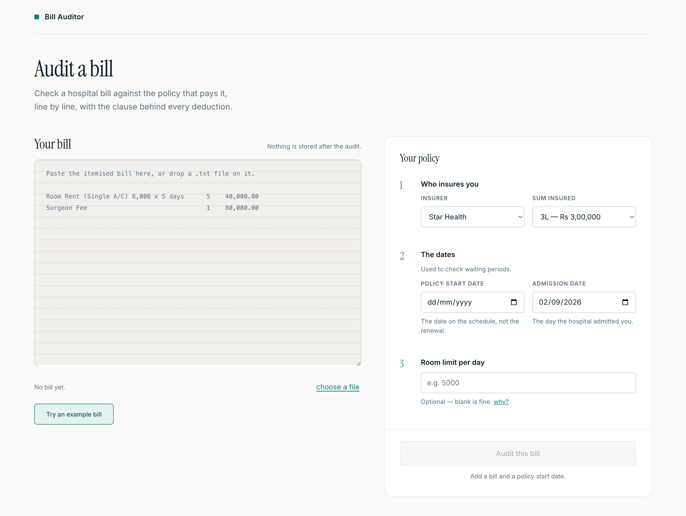
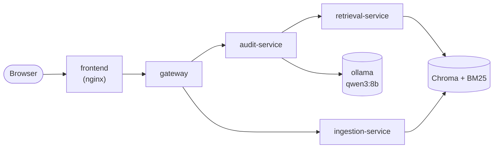

# Bill Auditor

Audits an Indian health insurance claim bill against the policy that governs it,
line by line, and names the clause behind every deduction.



## Results

**59.5% line accuracy over 44 bills / 328 lines, 0 fabricated clause citations.**

| | |
|---|---|
| Line accuracy (rupee figure within Rs 1) | **59.5%** |
| Citation accuracy | 51.9% |
| **Fabricated clause citations** | **0** |
| Bills / lines scored | 44 / 328 |
| Backend | ollama (qwen3:8b), retrieval on cpu |
| Recorded | 2026-09-02 |

That is the whole evaluation set and it is the number to plan around. Source row:
[`eval/results.md`](eval/results.md), section `v5-full - 2026-09-02`.

A fabricated citation — a clause id that is not in the policy index — is the
worst thing this system could produce, because it is confident and
unverifiable. It has been 0 at every version, and the way it is counted has its
own test, because it once was not.

### Version history — the same 10-bill subset every time

| Version | What changed | Line accuracy | Citation accuracy | Fabricated |
|---|---|---|---|---|
| v0 | Naive: one search, one judge call, no retry | 24.4% | 22.2% | **0** |
| v2 | LangGraph agent loop, retried on low confidence | *no row recorded* | *no row* | — |
| v3 | Proportionate-deduction second pass | *no row recorded* | *no row* | — |
| v4 | Room limit read from the table, not from the model | 59.8% | 48.1% | **0** |
| v5 | Waiting periods decided from dates, not from the model | **68.3%** | **56.8%** | **0** |

**These are 10 bills / 82 lines, not 44.** The subset is held constant so that a
change between two versions is attributable to the change and not to a different
sample; a full run takes around 45 minutes, which is too slow to sit between one
version and the next. **The honest overall number is the 59.5% above** — it is
the same v5 system over every bill, and it is lower because the other 34 bills
are harder than the first ten.

v2 and v3 are quoted as 51.2% and 54.9% in `PHASES.md` and `PROGRESS.md`, but
**`eval/results.md` holds no row for either**, so they are not printed here.

Full tables, including a rerank experiment that was tried and reverted, are in
[`eval/results.md`](eval/results.md).

## The problem

An insurer pays part of a hospital bill and sends a letter saying "deducted as
per policy terms". The patient has no way to check that. The rules are real, but
they are spread across a 50-page PDF written for lawyers.

Here is bill **B01** from the evaluation set — a Star Health policy at a
Rs 3,00,000 sum insured — exactly as the recorded 44-bill run audited it:

| Item | Charged | Allowed | Clause | Correct? |
|---|---:|---:|---|---|
| Room rent (single A/C), 8,000 x 5 days | 40,000 | 25,000 | II.1 | yes |
| ICU charges, 12,000 x 2 days | 24,000 | 10,000 | II.1 | **no — should be 24,000** |
| Surgeon fee | 80,000 | 50,000 | II.1 | yes |
| Anaesthetist charges | 15,000 | 9,375 | II.1 | yes |
| Medicines and drugs | 38,000 | 38,000 | II.16 | yes |
| Operation theatre charges | 22,000 | 13,750 | II.1 | yes |
| Investigations — CT and bloodwork | 14,000 | **flagged** | — | **no — should be 14,000** |
| Surgical gloves | 1,200 | 0 | IRDAI-List-I | yes |
| Disposable syringes | 800 | **flagged** | — | **no — should be 800** |
| Ambulance charges | 1,000 | 750 | II.8 | yes |

**Rs 2,36,000 charged. The system allowed Rs 1,46,875; the answer key says
Rs 1,75,675.** Seven lines of ten are right, one is wrong, and two were flagged
for a human rather than guessed at.

The surgeon's fee is the interesting one. Nothing in that line mentions the
room. It was cut to 50,000 because the *room* breached its 5,000-a-day cap, and
the policy shrinks the associated medical expenses in the same proportion —
5,000/8,000 = 0.625, and 80,000 x 0.625 = 50,000. No line-by-line check can ever
find that, because the reason is on a different line.

The ICU line is the mistake, and it is the same rule read one step too far:
Star Health's own definition of associated medical expenses (I.Def45)
*excludes* ICU charges, so the proportionate cut should not have touched it.
The system applied the ratio anyway.

## How it works

Setup runs once, offline: the policy PDFs are split on their clause numbers into
402 numbered clauses, embedded into ChromaDB, and indexed for BM25. Tables are
read structurally rather than as flowing text, because `extract_text()` reads a
room-rent table straight across and puts the wrong limit next to the wrong sum
insured.

Then, per bill line:

1. **Non-payable fast path.** Gloves, syringes and the rest of the IRDAI list are
   settled with no search and no model call. 124 of the 328 lines in the full run
   never reached the model at all.
2. **Room rent is a lookup.** Policy plus sum insured names the table row. The
   model is not asked, because it once read 800 a day off a table that grants a
   room *category*.
3. **Waiting periods are a date subtraction.** Two dates and the number the
   clause states, decided before any line is judged.
4. **Everything else goes to the loop:** classify the rule type, build a query,
   hybrid retrieve (Chroma and BM25 fused 0.6/0.4), rerank to the top 3, then ask
   the model one narrow question — which clause applies, and what limit does it
   state.
5. **Python does the arithmetic.** Always.
6. **The second pass.** Once every line has a verdict, a breached room-rent cap
   rescales the associated medical expenses. This is the part no per-line audit
   can do, and it is what produced the surgeon's fee above.

Retrieval is four stages rather than two, and the lexical channel is not
decoration: policy documents are full of terms that have to match literally
("Aggregate Deductible", "Excl03", "Vasofix Safety") and embeddings blur exactly
those. Long clauses are also split into sentence windows before reranking,
because Star Health states its room-rent table inside a 1,500-character clause
and the one relevant sentence is drowned when the whole thing is scored at once.

## How it decides when to stop

- **Three attempts, eight tool calls.** Then it abstains.
- **A confident answer is never re-asked.** Re-asking is where latency goes for no
  accuracy.
- **Two identical retrievals in a row stop the loop.** A third would cost a model
  call and tell us nothing.
- **A citation that is not in the index is rejected outright**, and the line
  abstains rather than retrying — the model was confident, so asking again gets
  the same answer. This is the guardrail that keeps fabricated citations at 0.
- **Below the rerank threshold the model is not called at all.** Reasoning over
  clauses that do not apply is worse than admitting the search missed.
- **When it abstains it says why**, and the line goes to a human.

In the full run, 163 lines went past their first attempt and 73 of those (45%)
produced an answer on a later one. The rest abstained.

The LLM never computes an amount. `JudgeOutput` deliberately has no `allowed`
field: the model reports a limit and a clause id, and Python multiplies. An 8B
model asked to multiply 5,000 by 5 will sometimes answer 20,000 and sound
certain, and a wrong total is invisible in a way a wrong citation is not.

## Known assumptions

Both Star Health and HDFC Ergo disapply proportionate deduction at hospitals
that "do not follow differential billing". Nothing on a hospital bill says
whether that hospital does, and no input to this system could carry it.

So the assumption is made — the deduction applies — and it is **printed with
every report**, stored in the trace with the clause that creates the problem, and
shown on screen in a panel that is never behind a toggle.
`--no-differential-billing` turns it off.

The other one is the room limit. Two of the three policies state no figure at
all: HDFC says "At Actuals unless otherwise specified in the Policy Schedule",
and Niva Bupa caps by room category "as specified in your Policy Schedule". So
there is an optional fourth input for it, and **leaving it blank is a valid
answer**: room-dependent lines come back flagged with the reason "room limit is
set by the policy schedule, which was not provided". Not a default. Not a guess.

## Evaluation

44 bills, 328 lines, across the three policies, covering clean bills, room-rent
breaches, non-payable items, sub-limits, room-category limits, missing schedules
and waiting periods.

**The answer key was derived by reading the policy PDFs, not by running the
pipeline.** `eval/derive_key.py` opens the PDFs with pdfplumber and imports no
retriever, judge or audit code, so a bug in the system cannot write itself into
the key and then be scored as a success. It also reads the PDFs by a different
route — whole pages rather than split clauses — so a splitter bug cannot
propagate into the key either. Every answered line quotes the sentence it came
from and shows the arithmetic:

```
"II.1 p10 table: Sum Insured 300,000 -> Up to 5,000/- per day;
 5,000 x 5 = 25,000, min(40,000, 25,000) = 25,000"
```

**The independence is of the plumbing, not of the reader.** The key was written
by a language model reading policy documents, and the judge in the pipeline is
also a language model reading policy documents. A misreading available to one is
available to the other. Ten bills are listed at the end of
[`eval/answer_key_provenance.md`](eval/answer_key_provenance.md) as needing a
person to check them against the source PDFs, **and that check has not been
done.** Until it is, treat the accuracy figures as provisional in that respect.
The same file records an unresolved conflict on B43 that needs a human decision.

Every metric is deterministic — a number matches or it does not, a clause id
matches or it does not. Nothing is scored by a model. An LLM judging its own
output would only tell us that the system agrees with itself.

Category accuracy over all 44 bills:

| Category | Lines | Line accuracy | Citation accuracy | Dodges | False answers |
|---|---:|---:|---:|---:|---:|
| non_payable | 95 | 77.9% | 74.7% | 20 | 0 |
| clean | 65 | 61.5% | 33.8% | 25 | 0 |
| schedule_missing | 13 | 61.5% | 41.7% | 4 | 1 |
| waiting_period | 31 | 58.1% | 58.1% | 5 | 0 |
| room_rent_over | 83 | 48.2% | 51.9% | 17 | 0 |
| room_category_limit | 15 | 40.0% | 26.7% | 3 | 6 |
| sub_limit | 26 | 34.6% | 24.0% | 16 | 1 |

Two numbers to read alongside those. **Abstention recall is 71.4%** — of the
lines that should have been flagged, it flagged just under three quarters — and
there were **8 false answers**, lines it answered confidently that it should have
flagged. Those eight are the failures that matter most, because a flagged line
gets looked at and a confidently wrong one does not. Six of the eight are in
`room_category_limit`.

The eval checkpoints every bill to `eval/.cache/runs/<version>/` keyed by a hash
of the bill and the answer key, so a crash resumes instead of discarding the run,
and a results row is written only when all 44 bills are present.

## Architecture

Six containers. Only the gateway and the frontend are published; the three inner
services are reachable on the compose network and nowhere else.



They are split because they scale differently, which is the only honest reason to
split anything:

- **ingestion** is heavy but rare. Splitting and embedding three PDFs takes
  minutes and a lot of memory, and happens when a policy is added, not when a
  bill is audited.
- **retrieval** is light and frequent. Every line calls it; it holds the indexes
  in memory. It is the one worth running two of.
- **audit** is slow and CPU-bound. One request occupies a worker for most of a
  minute. It gets the largest limits in `k8s/`.

`core/` stays a shared library that every service imports. The audit rules are
the product, and two copies of `money.py` would eventually disagree — as a wrong
rupee figure rather than an error.

**Images are built per service, not from one requirements file.** Every service
once installed all of `requirements.txt`, so the gateway — which forwards HTTP
and reads a JSON file — shipped `sentence-transformers` and through it `torch`.
Splitting the dependencies into extras, then pinning torch to the CPU wheel index
(the containers have no GPU: Docker Desktop on macOS has no passthrough and the
k8s manifests request no device), took the four Python images from 35.3 GB to
4.64 GB in total.

**Model weights are baked in at build time.** The first request after a deploy
used to pay for a HuggingFace download, which made the pod depend on the network
on every restart. The weights are fetched in the builder stage with
`HF_HUB_OFFLINE=1` set in the final image, so a missing file fails the build
rather than a pod:

| | cold start to `/ready` | of which, model load | readiness window |
|---|---|---|---|
| downloading at boot | 606s | — | 15 min |
| baked into the image | **13.8s** | 10.5s | 3 min |

That costs 1.50 GB in retrieval-service (bge-base plus the reranker) and 419 MB
in ingestion-service, which embeds but never reranks. Readiness gates on
`/ready`, which returns 503 until the models are loaded; liveness stays on
`/health`, so a slow warm-up cannot restart the pod it is waiting for.

## CI/CD

Jenkins multibranch. `feature/*` runs Build and Quality; `develop` adds Eval and
E2E; `main` adds Docker and Deploy.

**The Eval stage is the distinctive part.** It runs the auditor against the
answer key and fails the build when line accuracy drops below the threshold:

```
FAIL: line accuracy 0.503 is below the threshold 0.520
```

**The gate is `0.52`, against a baseline of 56.1%.** The stage runs `--quick`,
the first 10 bills, because a full 44-bill run takes about 40 minutes and does
not belong in CI. So the threshold is a *quick-subset* figure and must never be
read against the headline 44-bill number: the ten are easier than the
forty-four, and 51.5% over 44 bills and 56.1% over 10 are not comparable. The
baseline is the `ci-baseline-v7-quick` row in
[`eval/results.md`](eval/results.md) - 46 of 82 lines correct. One line is 1.22
points, so 0.52 sits just under three lines below it: ordinary drift passes, a
real regression does not. **It moves only when a new recorded row justifies it.**

Each bill's result is cached against a fingerprint of the audit code, so a
commit that changes `core/` recomputes rather than replaying — without that, a
warm CI workspace let a damaging commit pass the gate in one second. The
asymmetry is deliberate: **breaking accuracy costs a full re-run (1s to 64s on
the ten-bill subset), and reverting is free**, because the pre-break checkpoints
are still filed under their own fingerprint.

**It used to be 0.65, and that number was wrong for a reason worth stating.** It
was set against v5's 68.3%, a quick-subset run measured on a clause index that
was later found to contain corrupted tables - a merged cell read as belonging
only to its first column, and column headings forward-filled into data rows, so
`star_health II.5` carried "Vaporisation of the prostate" where nine sub-limits
belong. The 68.3% was measured against data that was wrong, so a threshold
derived from it never gated correct behaviour. It was replaced rather than
lowered: the current baseline is the first quick figure recorded on a corrected
index.

Unit tests can pass while the audit quietly gets worse — a retrieval change, a
prompt change, a splitter change. None of those break a test; all of them move
the number. This stage is what makes that visible, and `git bisect run` with the
same command finds the commit that did it. Step-by-step setup, including what to
do when that stage goes red, is in [`JENKINS_SETUP.md`](JENKINS_SETUP.md).

## What I learned

- **A PDF table flattened into text corrupts every rupee figure downstream, and
  nothing errors.** Star Health's room-rent table read straight across put
  `5,00,000` next to the limit belonging to the 3L and 4L rows — so a judge
  reading it picks the wrong row and sounds certain. The output still looked like
  text, so nothing failed, and it broke three times before
  `tests/test_tables_golden.py` froze the extracted text of the eight
  rule-bearing table clauses and started failing on any diff.

- **Both accuracy jumps came from taking the model out of the decision, not from
  prompting it harder.** Reading the room limit from the table by policy and sum
  insured, with no judge call, moved line accuracy **54.9% → 59.8% (+4.9pp)** at
  v4. Deciding waiting periods by subtracting two dates moved it **59.8% → 68.3%
  (+8.5pp)** at v5, and took the `waiting_period` category from 0.0% to 100% on
  the subset. Every prompt change I tried was worth a fraction of either.

- **A scoring bug made 18 correct citations look like fabrications.** The scorer
  built its list of legitimate clause ids from `clauses.json` alone, so every
  citation of the IRDAI non-payable list — a real, checkable source that simply
  lives in a different file — was counted as invention. The headline metric of
  this project was wrong in the direction that made the system look worse, which
  is why it went unquestioned for a while. It has its own test now: a metric that
  can break silently is worse than no metric.

- **Retrieval is ~92% of the wall clock, so a 4x worker pool bought 1.27x.**
  Lines are independent in the first pass, so bounded concurrency needed no
  change to any audit rule — a `ThreadPoolExecutor` and `BA_AUDIT_WORKERS`. I
  expected roughly 4x. B01 through the gateway, cache off, idle machine:

  | workers | wall clock | speed-up | in the model | limiter asleep |
  |---|---:|---:|---:|---:|
  | 1 | 222.6s | 1.00x | 14.1s | 0.0s |
  | 2 | **175.1s** | **1.27x** | 16.7s | 0.0s |
  | 4 | 170.6s | 1.30x | 14.6s | 37.3s |

  The model is 6–8% of a line at every width. One search already pegs all ten
  cores, so extra workers queue for a resource that was never idle; the fourth
  buys 2.6% — noise — and puts the token bucket to sleep for 37 seconds. The
  default is 2. Making this materially faster means a cheaper reranker, not more
  of it at once.

## Where it still fails

- **Sub-limit lines abstain when there is no sub-limit.** 34.6% accuracy, 16
  dodges over 26 lines. The loop can find a cap or fail to find one; it has no
  way to say "nothing limits this line, so pay it in full". Fixing it changes the
  judge contract and risks turning safe abstentions into confident overpayments,
  so it needs its own eval slice first.
- **`room_category_limit` produces six of the eight false answers.** 40.0%
  accuracy over 15 lines. This is the one category where the system is confidently
  wrong more often than it abstains, which makes it the worst-behaved of the seven.
- **Star Health waiting periods are not applied.** Its clause III.2 states the 24
  months and then says "f. List of specific diseases/procedures;" — and the list
  is on the next page and did not survive extraction. The system refuses to act
  on a list it cannot read, so a Star Health hernia claim inside the waiting
  period is paid rather than excluded.
- **Pre-existing disease is never applied.** Nothing on a bill says whether a
  condition pre-dated the policy, and nothing the user types says so either.
- **The Metal contention was never established as the cause of the eval crash.**
  Judging lines concurrently killed the eval on bill one, and a Metal
  command-buffer assertion appeared in the output. Serialising the forward passes
  fixed the crash — but the GPU error appears *after* `[Errno 61] Connection
  refused`, i.e. after Ollama had already stopped answering, so the ordering does
  not support the hypothesis. The lock is justified by the MPS single-queue
  constraint, not by a demonstrated causal chain, and I have not proven what
  actually killed the run.
- **The backend-recovery path is unit-tested but has never fired in a real run.**
  The successful 44-bill run logged zero connection warnings, so the code that
  waits for a dead backend to come back is covered by tests around
  `is_unreachable` and by nothing else. It has not been exercised end to end.

The first four are written up with diagnoses in
[`KNOWN_LIMITATIONS.md`](KNOWN_LIMITATIONS.md).

## What this doesn't do

It does not handle cashless authorisation denials, settlement delays, or disputes
about whether a treatment was medically necessary. It does not judge whether the
hospital's rates were fair — only what the policy says the insurer owes against
the rates charged. It is not legal advice, and a flagged line means a person
still has to look.

## Running locally

```bash
uv sync
ollama pull qwen3:8b                      # the judge model, running on your machine
uv run python -m core.ingest              # build the clause index, once

uv run uvicorn api.main:app --reload      # API on :8000, docs at /docs
cd frontend && npm install && npm run dev # UI on :5173
```

On the command line, without the browser:

```bash
uv run python -m core.audit data/sample_bill.txt --policy star_health --sum-insured 300000 \
  --agent --second-pass --admission-date 2026-01-10 --policy-start-date 2023-01-01
```

Tests and the evaluation:

```bash
uv run python -m unittest discover -s tests          # 353 PyUnit tests
uv run pyb run_unit_tests                            # the same, the way Jenkins runs them
uv run python eval/evaluate.py --quick --agent --second-pass
uv run python eval/evaluate.py --agent --second-pass # all 44 bills, ~45 minutes, resumable
```

## Two LLM backends, for two different jobs

| Backend | Model | Speed | Limits | Default for |
|---|---|---|---|---|
| `ollama` | Qwen3 8B, local | ~11s a line | none, works offline | the eval, the CLI, the tests |
| `groq` | gpt-oss 120B, hosted | ~1s a call | 30 req/min, 6,000 tokens/min, 1,000 req/day | the API and the UI |

The split exists because the two are good at opposite things. Groq is fast per
call and rate limited; Ollama is slow per call, unlimited and offline. A person
waiting on a ten-line bill should not wait two minutes, and a 44-bill evaluation
is roughly 400 calls — it would spend Groq's entire daily allowance and then
crawl under the token cap.

One bill line, same clause, one judge attempt, on an idle machine
(`eval/where_time_goes.py`):

| | Groq (hosted) | Ollama (local) |
|---|---:|---:|
| **Total per line** | **6.1s** | **29.5s** |
| Retrieval, 2 searches | 3.7s | 18.3s |
| Model call | 1.7s | 8.1s |

The model call being 4.8x slower locally is expected. The surprise is the
retrieval row: it is *the same work* in both runs — same two searches, same
cross-encoder, no model involved — and it takes five times longer when Ollama is
the backend, because Ollama saturates the CPU the reranker needs. Two components
that never call each other, coupled through the machine they share. "Use a local
model to stay free" is not a self-contained decision on a single box.

Every default lives in `core/config.py` (`backend_for`), never at a call site.
`BA_LLM_BACKEND` overrides all of them, which is how Docker and Kubernetes choose
with no code change, and `--backend` forces one for a single run:

```bash
uv run python eval/evaluate.py --quick --agent --backend groq
uv run python -m core.audit bill.txt --backend ollama
```

Four things hold across both, and each has a test:

- **The judge contract.** Both go through the same
  `with_structured_output(JudgeOutput)` path, so parsing that works for one and
  not the other is a bug rather than a difference of backend.
- **The disk cache is keyed by backend and model**, so switching does not serve a
  Qwen answer as a Llama one.
- **Masking runs first, and the hosted path refuses text that still contains an
  identifier.** `core.backends.guard_pii` raises before the client is reached.
  That guard is what makes a hosted backend acceptable at all.
- **Fabricated-citation checking is unchanged.** Same rules, both backends.

The token cap binds before the request cap — 6,000 tokens a minute is about six
judge calls, well inside the 30 requests the same minute allows — so the limiter
counts tokens, not requests. A 429 is retried with exponential backoff, honouring
Groq's own `try again in Ns` when it sends one. When the *daily* quota is gone
the audit does not stop: it finishes on Ollama, logs the switch, and records it
in the report's assumptions block, because a report that changed model half way
through has to say so. The fallback is per call with a cooldown that expires, and
`/stats` reports the backend actually in force rather than the configured one.

Get a free key at <https://console.groq.com/keys> and put it in `.env` as
`BA_GROQ_API_KEY`. See `.env.example`; `.env` is gitignored.

## Running with Docker

```bash
docker compose build
docker compose up -d
docker compose ps                       # healthchecks make this honest
docker compose exec ollama ollama pull qwen3:8b
open http://localhost:5173              # the app
curl http://localhost:8000/health       # the gateway and its dependencies
docker compose logs -f audit-service
docker compose down                     # -v also drops the volumes
```

The embedding and reranker weights are baked into the images; the Qwen model is a
mounted volume and is never baked in.

## Deploying to Kubernetes

```bash
minikube start --memory=8192 --cpus=4 --disk-size=40g
eval $(minikube docker-env)             # build into the cluster's daemon
kubectl apply -f k8s/
kubectl -n bill-auditor get pods -w
open "http://$(minikube ip):30173"
```

Full commands, including how to point the cluster at a hosted model instead of
running an 8B model in a pod, are in [`k8s/README.md`](k8s/README.md).

## Layout

| Path | What is in it |
|---|---|
| `core/` | the audit rules: splitter, retrieval, agent, second pass, money |
| `api/` | the FastAPI monolith — one process, used for local development and the eval |
| `services/` | the same code split into four containers for deployment |
| `frontend/` | React + TypeScript, with the design tokens in `frontend/design/` |
| `eval/` | 44 bills, the derived answer key, and the scorer |
| `tests/` | PyUnit, including the Selenium flow in `tests/e2e/` |
| `k8s/` | manifests for minikube |
| `docs/` | the screenshot this README embeds |

`PHASES.md` is the build plan, `PROGRESS.md` is what was done, `DECISIONS.md` is
why, and `BLOCKED.md` is what still needs a human.
